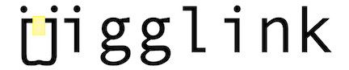

# Side project

##### Brief
**Jigglink** is a simple note application MVP that facilitates and speeds up our concept learning process inspired by [Feynman's deep understanding technique](https://fs.blog/feynman-technique/), and the [Scrum timeboxes events dynamic](https://www.scrum.org/forum/scrum-forum/7242/time-boxed-events).

##### Features

###### v0.1

- Create and size a concept
- Update a concept
- Start/Stop concept timer
- Create a concept Idea

###### v0.2

- Accumulate concept itinerary points
- Reedem badges based on point rules accumulation
